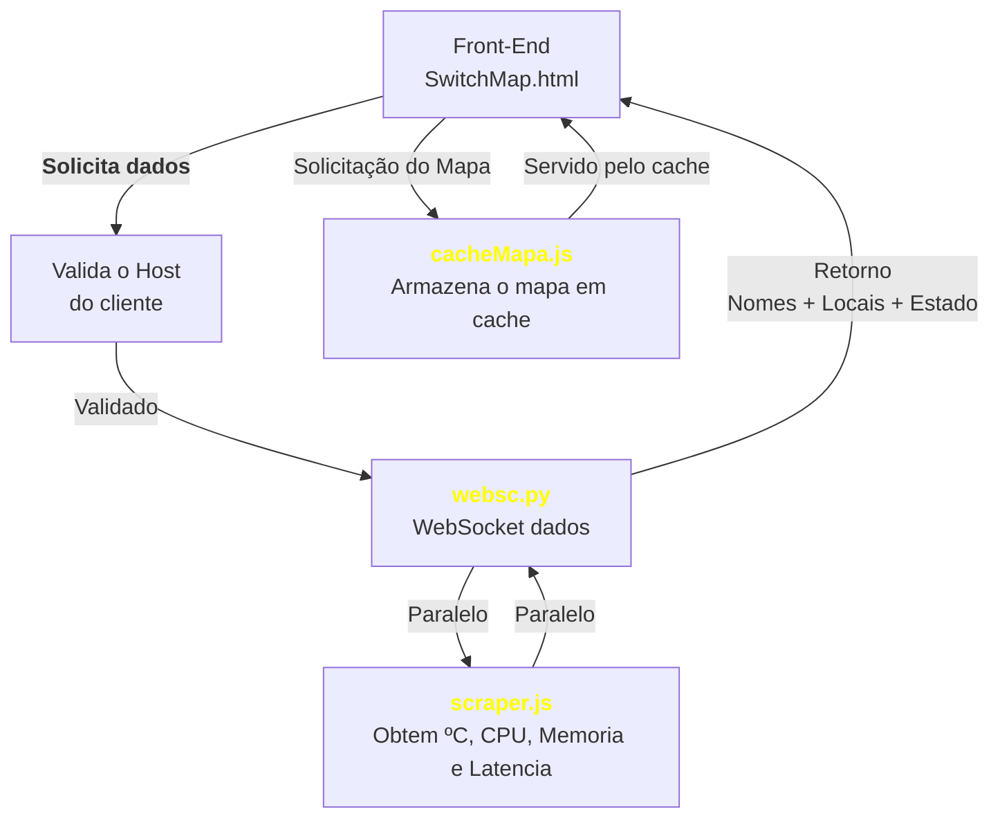

# SwitchMap 2.0

## Uma visão inteligente da sua rede
O **SwitchMap 2.0** transforma dados brutos de infraestrutura em uma interface visual interativa, facilitando o monitoramento e a tomada de decisão. Com um mapa dinâmico, ele exibe a posição dos dispositivos de rede, suas conexões e métricas essenciais em tempo real.

## O que ele faz?
Imagine que cada switch da rede não seja apenas um nome em uma lista, mas um ponto visível e organizado em um mapa. O **SwitchMap 2.0** faz exatamente isso: localiza, monitora e estrutura a relação entre os equipamentos, tornando simples a identificação de falhas e gargalos.

### Principais recursos:
- **Mapeamento interativo** – Cada dispositivo tem sua posição exata no mapa.
- **Status em tempo real** – Equipamentos online e offline visíveis instantaneamente.
- **Métricas inteligentes** – Temperatura, uso de CPU e latência sempre atualizados.
- **Hierarquia de dependências** – Identifica automaticamente os impactos de falhas.
- **Alertas automáticos** – Notificações imediatas quando algo sai do esperado.

## Como funciona?
O sistema opera por meio de três componentes principais:

1. **Servidor WebSocket + Autenticação (Python)**
   - Valida quais máquinas podem acessar a aplicação.
   - Coleta e distribui os dados dos dispositivos.

2. **API de Consulta (Node.js)**
   - Processa as informações recebidas e gera a estrutura de rede.
   - Exibe os dispositivos no mapa interativo.

3. **API de Cache (Node.js)**
   - Reduz a latência de carregamento armazenando versões temporárias do mapa.
   - Garante que os dados sejam entregues rapidamente aos usuários.

## Monitorar o funcionamento + Logs

Exemplo da interface de monitoramento (cpu.py + testes/index.html)

Exemplo da interface para acompanhar logs de conexão (cpu.py + testes/log/index.html)

## Por que usar?
- **Agilidade** – Identificação instantânea de falhas.
- **Clareza** – Interface intuitiva e organizada.
- **Eficiência** – Redução do tempo de resposta com cache otimizado.
